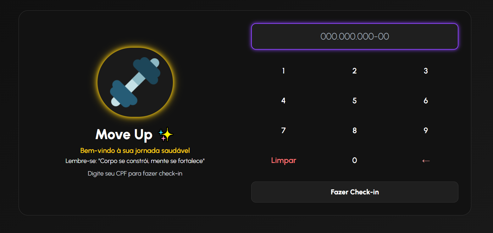

# Academia MoveUp

A **Academia MoveUp** é uma plataforma web moderna desenvolvida para otimizar a gestão de academias e melhorar a experiência dos alunos. Com uma interface intuitiva e responsiva, o sistema oferece funcionalidades que facilitam o acompanhamento de treinos, controle de presença e acesso a informações relevantes.

## 🔍 Visão Geral

A plataforma foi projetada para atender às necessidades de academias, permitindo que alunos e instrutores interajam de forma eficiente. Com recursos que vão desde o acompanhamento de treinos até a comunicação direta com os instrutores, o sistema visa proporcionar uma experiência completa e integrada.

## 🚀 Funcionalidades

- **Dashboard Personalizado**: Visualização rápida das informações mais relevantes para o usuário.
- **Acompanhamento de Treinos**: Registro e monitoramento dos treinos realizados.
- **Controle de Presença**: Sistema de check-in e check-out para alunos.
- **Comunicação com Instrutores**: Canal direto para dúvidas e orientações.
- **Perfil do Usuário**: Atualização de informações pessoais e preferências.

## 🛠️ Tecnologias Utilizadas

- **HTML5**  
- **Tailwind CSS**  
- **JavaScript (JS)**  
- **Google Fonts (Urbanist)**  

## 📦 Instalação e Execução

1. **Clone o repositório**:

   ```bash
   git clone https://github.com/seu-usuario/academia-moveup.git
   cd academia-moveup
   ```

2. **Instale as dependências**:

   ```bash
   npm install
   ```

3. **Configure as variáveis de ambiente**:

   Crie um arquivo `.env.local` na raiz do projeto e adicione as seguintes variáveis:

   ```env
   NEXT_PUBLIC_API_URL=http://localhost:3000/api
   MONGODB_URI=your_mongodb_connection_string
   ```

4. **Inicie o servidor de desenvolvimento**:

   ```bash
   npm run dev
   ```

5. **Acesse a aplicação**:

   Abra o navegador e vá para `http://localhost:3000` para visualizar a plataforma.

## 📸 Visualização

> *(Visualização do projeto)*  

> 

> *(Gif para visualização)*
> 


## ✨ Estilo Visual

A interface utiliza uma estética **moderna**, com:
- **Tema escuro**
- **Cores vibrantes (neon)**
- **Fontes Urbanist com destaque**
- **Componentes com sombras e animações suaves**

---

## 🧩 Integração

- **Back end utilizado:** [Api Vercel](https://api-catraca-weld.vercel.app/)
- **Visão do Administrador:** [Visualização Administrador](https://moveupadmin.vercel.app/)
- **Visão do Usuario:** [Visualização Catraca (Usuario)](https://academiamoveup.vercel.app/)
- **Apresentação Canva:** [Link Canva](https://www.canva.com/design/DAGlYPV_-Ys/osxLww1Iwx3L_ZwcEt4l8w/edit?utm_content=DAGlYPV_-Ys&utm_campaign=designshare&utm_medium=link2&utm_source=sharebutton)

---

## 📄 Licença

Este projeto está licenciado sob a [MIT License](LICENSE).

---

Para mais informações e demonstrações, visite o site oficial: [academiamoveup.vercel.app](https://academiamoveup.vercel.app/)

## Autores
| [<br><sub>Sarah Dias Venâncio</sub>](https://github.com/SarahVenancio) |  [<br><sub>Julia de Moura Rosa</sub>](https://github.com/JuliaRosa0401) |
| :---: | :---: |